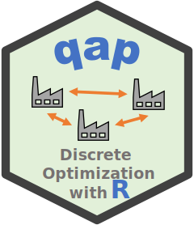

#  R package qap - Heuristics for the Quadratic Assignment Problem (QAP)

[](https://CRAN.R-project.org/package=qap)
[](https://mhahsler.r-universe.dev/qap)
[](https://CRAN.R-project.org/package=qap)

## Introduction

This package implements heuristics for the [Quadratic Assignment Problem
(QAP)](https://en.wikipedia.org/wiki/Quadratic_assignment_problem). The
QAP was introduced as a combinatorial optimization problem from the
category of facilities location problems in operations research
(Koopmans and Beckmann; 1957). It also has many applications in data
analysis including cluster analysis and seriation (see Hubert and
Schultz; 1976).

The problem is NP-hard and the package implements the very effective
simulated annealing heuristic described in Burkard and Rendl (1984).

The following R packages use `qap`:
[seriation](https://CRAN.R-project.org/package=seriation)

To cite package ‘qap’ in publications use:

> Hahsler M (2022). *qap: Heuristics for the Quadratic Assignment
> Problem (QAP)*. R package version 0.1-2,
> <https://github.com/mhahsler/qap>.

    @Manual{,
      title = {qap: Heuristics for the Quadratic Assignment Problem (QAP)},
      author = {Michael Hahsler},
      year = {2022},
      note = {R package version 0.1-2},
      url = {https://github.com/mhahsler/qap},
    }

## Installation

**Stable CRAN version:** Install from within R with

``` r
install.packages("qap")
```

**Current development version:** Install from
[r-universe.](https://mhahsler.r-universe.dev/qap)

``` r
install.packages("qap", repos = "https://mhahsler.r-universe.dev")
```

## Usage

The package contains a copy of the problem instances and solutions from
[QAPLIB](https://www.opt.math.tugraz.at/qaplib/). We load the `had20`
QAPLIB problem. The problem contains the A and B matrices and the
optimal solution and the optimal objective function value.

``` r
library(qap)
set.seed(1000)

p <- read_qaplib(system.file("qaplib", "had20.dat", package = "qap"))
p$solution
```

    ##  [1]  8 15 16 14 19  6  7 17  1 12 10 11  5 20  2  3  4  9 18 13

``` r
p$opt
```

    ## [1] 6922

We run the simulated annealing heuristic 10 times and use the best
solution.

``` r
a <- qap(p$A, p$B, rep = 10)
a
```

    ##  [1]  8 15 16 14 19  6  7 12  1 11 10  5  3 20  2 17  4  9 18 13
    ## attr(,"obj")
    ## [1] 6926

Compare the solution with known optimum (% above optimum).

``` r
(attr(a, "obj") - p$opt)/p$opt * 100
```

    ## [1] 0.058

## References

- Hahsler M (2022). *qap: Heuristics for the Quadratic Assignment
  Problem (QAP)*. R package version 0.1-2,
  <https://github.com/mhahsler/qap>.
- R.E. Burkard and F. Rendl (1984). A thermodynamically motivated
  simulation procedure for combinatorial optimization problems.
  *European Journal of Operations Research,* 17(2):169-174.
  <https://doi.org/10.1016/0377-2217(84)90231-5>
- Koopmans TC, Beckmann M (1957). Assignment problems and the location
  of economic activities. *Econometrica* 25(1):53-76.
  <https://doi.org/10.2307/1907742>
- Hubert, L., and Schultz, J. (1976). Quadratic assignment as a general
  data analysis strategy. *British Journal of Mathematical and
  Statistical Psychology,* 29(2), 190–241.
  <https://doi.org/10.1111/j.2044-8317.1976.tb00714.x>
